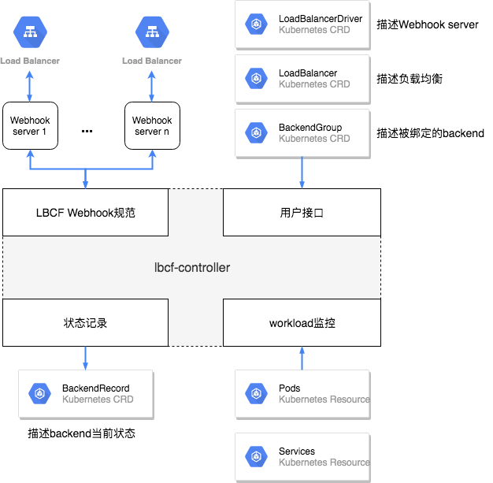

## 设计目标

**LBCF**是专为Kubernetes平台操作负载均衡设计的通用框架，定位于对社区service-controller方案的增强，相较于社区的service-controller，LBCF具有以下特点：

* 每个Pod可以独立绑定

  不同于service-controller通过nodePort将多个Pod作为整体进行绑定的方式，LBCF可以将每个Pod独立绑定，因此，对于被操作的负载均衡而言，每一个被绑定的backend都只对应一个Pod
  
* 兼容绑定Service NodePort

  LBCF兼容了使用Service NodePort的绑定方式，但与service-controller不同的是，使用LBCF绑定的Service NodePort地址可以与其他地址共享同一个负载均衡
    
* 支持负载均衡共享

  不论是Pod独立绑定还是使用Service NodePort，LBCF都能支持负载均衡的共享。原因在于LBCF不以全量diff的方式决定需要进行的绑定/解绑操作，而是为每个需要绑定的backend(Pod或NodePort）单独维护绑定任务，这使得LBCF在进行绑定与解绑操作时不会影响到相同LB下的其他backend，从而可以实现LB的共享
  
* 灵活的扩展 
  
  LBCF对容器生命周期中的各种事件进行了封装，并以Webhook的方式对外暴露，开发者只需按照[LBCF Webhook规范](lbcf-webhook-specification.md)的要求实现一个Webhook服务器即可完成对负载均衡的定制化控制
  
* 异步操作

  对于一些耗时较长的操作（如创建负载均衡），开发者可以将操作以异步方式实现，LBCF支持操作结果的循环查询
  
* 优化的交互逻辑   

  service-controller在交互逻辑上存在一些弊病，如：无法拒绝非法请求、难以直观观察绑定状态、信息反馈过度依赖自身日志等。
  
  LBCF对上述缺点进行了针对性的优化设计，如：支持使用者进行请求的校验、以Events的方式对外输webhook调用结果、使用status.condition记录当前状态等。使用者无需了解LBCF内部实现即可进行系统调试与二次开发。
  
  
## 架构设计

LBCF架构中，负载均衡操作由两部分协同完成，分别为执行统一管理逻辑的lbcf-controller与执行自定义操作逻辑的Webhook server，二者之间使用[LBCF Webhook规范](lbcf-webhook-specification.md)进行通信。

* lbcf-controller
  
  lbcf-controller将负载均衡的管理抽象为8个统一操作，分别对应[LBCF Webhook规范](lbcf-webhook-specification.md)中的8个webhook, lbcf-controller对每次webhook的调用时机、调用结果以及重试策略进行管理。
  
  由于lbcf-controller会将webhook的调用结果持久化保存至K8S，因此Webhook server可以是无状态的。
  
* Webhook server

  Webhook server的作用类似于操作系统中的硬件驱动程序，外部负载均衡/名字服务即是接入操作系统的各种硬件，Webhook server接收来自操作系统(LBCF)的统一指令（Webhook调用），进行自定义操作后返回统一格式的操作结果。

LBCF定义了4种CRD，其中3种用来进行用户交互，1种用来保存系统当前状态：

* LoadBalancerDriver
  
  LoadBalancerDriver用来描述Webhook server，包括server的地址、每种webhook的超时时间等
  
* LoadBalancer

  LoadBalancer用来描述被操作的负载均衡，包括负载均衡的唯一标识（如lbID）、使用的属性（如健康检查、会话保持）等
  
  LoadBalancer中的字段由Webhook server实现者定义，并由Webhook server进行解析
  
* BackendGroup

  BackendGroup用来描述被操作的backend，分为Pod、Service以及静态地址3中类型，Webhook server实现方可以在BackendGroup中定义绑定操作使用的额外参数（如权重）
  
* BackendRecord

  BackendRecord由lbcf-controller根据提交到K8S的上述3中CRD自动生成，用来保存每个负载均衡backend的当前状态，如绑定使用的参数、绑定结果等
  
4种CRD的详细定义见[LBCF CRD定义](lbcf-crd.md))

